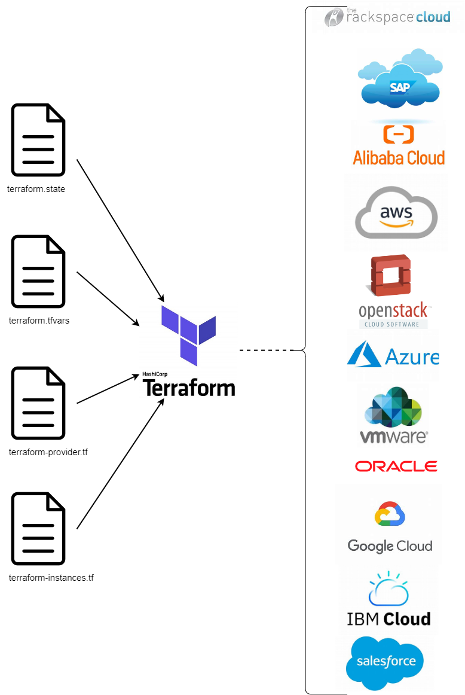

## 

---

<h1 align="center">
Terraform / Proxmox
</h1>

---

 

 
<a href="https://registry.terraform.io/browse/providers">Terraform Registry</a></a>

 

---

 

<h2>
Table des matières
</h2>

 

[Qu'est-ce que Terraform ?](Terraform_Proxmox-2.md)

[Structure des fichiers de configuration Terraform](Terraform_Proxmox-3.md)

[Les arguments](Terraform_Proxmox-4.md)

[Quelques exemple de fichier ressource (template)](Terraform_Proxmox-5.md)

[Prérequis](Terraform_Proxmox-6.md)

[Mise en place](Terraform_Proxmox-7.md)
